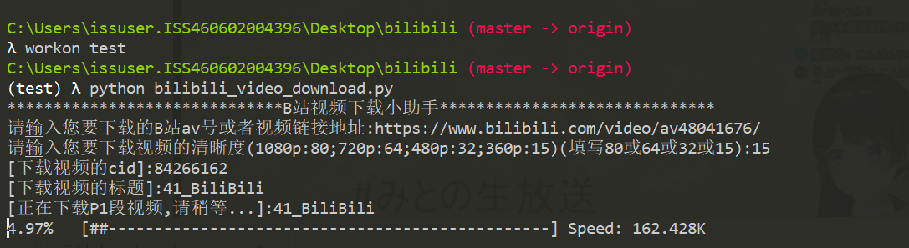

Bilibili(b站)视频下载 
===========================
### Bilibili官网 - https://www.bilibili.com/

## 项目Github地址: <https://github.com/chenjie222/bilibili>

## 介绍

### 该项目为[Bilibili(b站)](https://www.bilibili.com/)视频下载(支持分P多段视频的下载!)
- 项目介绍:通过传入B站av号或者视频链接地址下载视频
- 爬虫文件:Spiders目录下的bilibili_video_download.py


## 运行环境

Version: Python3


## 安装依赖库

```
pip3 install -r requirements.txt
```
> 安装ffmpeg.exe

```
>>>python
>>>import imageio
>>>imageio.plugins.ffmpeg.download()
```

##运行

```
python bilibili_video_download.py
```

## 运行截图

> - **运行下载**<br><br>

> - **下载完成**<br><br>
